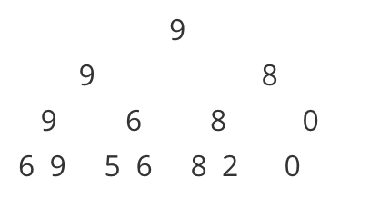

线段树基础版关键词：**单点替换，区间最值**。

<!---more--->

用二分法的思想。建立完全二叉树--》叶节点是每个元素。

父亲节点则是要保存的结果元素。比如给出数组：[6,9,5,6,8,2,0]  求某个区间最大的数：



所有的查询只需要建树完就搞定。

由于是完全二叉树。可以直接用数组做~

假设我们现在要求给定区间的Max值。下面一步步分析过程。

# 准备工作

```cpp
//rt:root的意思
#define lson rt<<1
#define rson rt<<1|1
#define m (l+r)>>1
```

解释：在数组中，第i节点的左孩子lson就是 ix2,有孩子rson就是 ix2+1

# 建树

先介绍 pushUp 方法，在我们建树和更新的时候要用，

```cpp
void pushUp(int rt){
    tree[rt] = max(tree[lson],tree[rson]);
}
```

解释：传入root节点下标，通过它的左右孩子值，取二者最大的存入

然后就是 建树的过程：

```cpp
void build(int l,int r,int rt){
    if(l==r)//是叶节点，存数并返回(叶节点不必执行pushUp)
    {
        tree[rt] = vt[i++];//从vt里读取数据存入tree中
        return;
    }//不是叶节点就走下面的过程
    int m = (l+r)>>1;
    build(l,m,lson);
    build(m+1,r,rson);
    pushUp(rt);
}
```

解释：如果是叶节点，从vt中取数存入。如果不是，分别递归地建左右子树。（建左右的子树的过程中一定可以把改存入的叶节点都存入），最后执行pushUp，根据我们的叶节点，就能层层Up把父节点的值存入了。

比如我们的vt中存入：

```cpp
vector<int> vt{6,9,5,6,8,2,0};
build(1,7,1);
```

打印tree看一下：

`[1]:9 [2]:9 [3]:8 [4]:9 [5]:6 [6]:8 [7]:0 [8]:6 [9]:9 [10]:5 [11]:6 [12]:8 [13]:2 `

# 更新

我们先看单点更新的情况，只需要配合前面的pushUp，更新了叶节点之后，再层层Up把改更新的父节点也更新就好了：

```cpp
void update(int index,int newVal,int l,int r,int rt){//单点更新，只需要一个坐标即可
    cout<<__func__<<l<<','<<r<<','<<rt<<'\n';
    if(l==r){
        tree[rt]=newVal;
        return;
    }
    int m = (l+r)>>1;
    if(index<=m)
        update(index,newVal,l,m,lson);
    else
        update(index,newVal,m+1,r,rson);
    pushUp(rt);
}
```

解释：由于只更新index这一个点。我们看index和m的大小，判断继续更新左子树还是右子树。

现在我们更新第6个点，把原来的2换成99：

```cpp
update(6,99,1,7,1);//插入
```

输出结果：

```cpp
update1,7,1
update5,7,3
update5,6,6
update6,6,13
[0]:0 [1]:99 [2]:9 [3]:99 [4]:9 [5]:6 [6]:99 [7]:0 [8]:6 [9]:9 [10]:5 [11]:6 [12]:8 [13]:99 [14]:0 [15]:0 
```

# 查询

查询的过程，如果欲查询的区间刚好是二叉树从中间分开的区间，我们直接返回对应的坐标即可。

需要处理的就是，欲查询区间分别在左右子树，不能一次性返回结果。

```cpp
int query(int L,int R,int l,int r, int rt){//[L,R]是要查询的区间
    cout<<__func__<<" ["<<L<<','<<R<<"] ("<<l<<','<<r<<") "<<rt<<'\n';
    if(L<=l&&R>=r){//如果[L,R]里有(l,r)区间，直接返回对应的根节点
        return tree[rt];
    }
    int m = (l+r)>>1;
    int ans = 0;
    if(L<=m){
        ans = max(ans,query(L,R,l,m,lson));
    }
    if(R>=m+1){
        ans = max(ans,query(L,R,m+1,r,rson));
    }
    return ans;
}
```

直接看代码可能有点迷，我们还是运行一下看：

现在要查询刚刚那7个数中，第二个到第6个里的最大值。即区间[2,6]。

```cpp
cout << query(2,6,1,7,1);
```

输出：

```cpp
query [2,6] (1,7) 1
query [2,6] (1,4) 2
query [2,6] (1,2) 4
query [2,6] (2,2) 9 //tree[9]=9 Max=9
query [2,6] (3,4) 5 //tree[5]=6 Max=9
query [2,6] (5,7) 3
query [2,6] (5,6) 6	//tree[6]=99 Max=99
99
```

分析：查[2,6]里的Max，

1. 跟[1,7]对比发现，1不在[2,6]
2. 跟[1,4]对比发现，1不在[2,6]
3. 跟[1,2]对比发现，1不在[2,6]
4. 跟[2,2]对比，[2,2]在[2,6]中，返回tree[9] 是9
5. 跟[2,2]对比，[3,4]在[2,6]中，返回tree[5] 是6
6. 跟[5,7]对比发现，7不在[2,6]
7. 跟[5,6]对比，[5,6]在[2,6]中，返回tree[6] 是99

综上，把区间[2,6]拆成了（2）（3,4）（5,6）三个区间，从9、6、99里返回了最大的99

# 基础版代码（仅单点更新）

```cpp
//线段树 求解区间最值问题
#include <iostream>
#include <vector>
//#include "../Vt.h"
//rt:root
#define lson rt<<1
#define rson rt<<1|1

using namespace std;

vector<int> vt{6,9,5,6,8,2,0};
int i = 0;
vector<int> tree(16);

void pushUp(int rt){
    tree[rt] = max(tree[lson],tree[rson]);
}

void build(int l,int r,int rt){
    if(l==r)//是叶节点，存数
    {
        tree[rt] = vt[i++];
        return;
    }
    int m = (l+r)>>1;
    build(l,m,lson);
    build(m+1,r,rson);
    pushUp(rt);
}

void update(int index,int newVal,int l,int r,int rt){//单点更新，只需要一个坐标即可
    cout<<__func__<<l<<','<<r<<','<<rt<<'\n';
    if(l==r){
        tree[rt]=newVal;
        return;
    }
    int m = (l+r)>>1;
    if(index<=m)
        update(index,newVal,l,m,lson);
    else
        update(index,newVal,m+1,r,rson);
    pushUp(rt);
}

int query(int L,int R,int l,int r, int rt){//[L,R]是要查询的区间
    cout<<__func__<<" ["<<L<<','<<R<<"] ("<<l<<','<<r<<") "<<rt<<'\n';
    if(L<=l&&R>=r){//如果[L,R]里有(l,r)区间，直接返回对应的根节点
        return tree[rt];
    }
    int m = (l+r)>>1;
    int ans = 0;
    if(L<=m){
        ans = max(ans,query(L,R,l,m,lson));
    }
    if(R>=m+1){
        ans = max(ans,query(L,R,m+1,r,rson));
    }
    return ans;
}

int main(){
    build(1,vt.size(),1);
   	//showVtwithIndex(tree);

    update(6,99,1,vt.size(),1);//插入
    //showVtwithIndex(tree);

    cout << query(2,6,1,7,1);
    return 0;
}
```

关于区间更新、延迟加载。请看 [线段树完全版](../SegmentTree2)