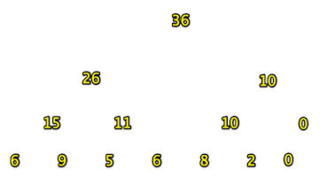
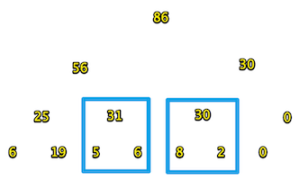

线段树完全版关键词：**延迟加载、懒标记Lazy Tag**

<!---more--->

单点更新的情况比较简单。请看 [线段树基础版](../SegmentTree)

下面说说区间更新的情况。

场景是这样的，还是刚刚的数，求区间的和。

# 准备工作

```cpp
//rt:root
#define lson rt<<1
#define rson rt<<1|1
#define len (r-l+1) //(l,r)区间的长度
```

这次是区间更新，我们要用到区间的长度

# 建树


build和pushUp不变。我们把树建立好打印一下：

`[1]:36 [2]:26 [3]:10 [4]:15 [5]:11 [6]:10 [7]:0 [8]:6 [9]:9 [10]:5 [11]:6 [12]:8 [13]:2 [14]:0 `



# pushDown 重点

> 延迟加载、懒标记思想：
>
> 假设现在要把区间【2,6】里5个数全加10，求总和。会数学的都知道，一共加了50，总和变成86。就是说对一段区间的统一操作，不需要对区间里的单个点进行改动。
>
> 只改动他们的老祖宗，并**在他们的祖宗上做一个标记**。以后啥事需要用到儿子了，一看父亲上有标记，就知道这个儿子还需要被更新。

下面的代码就是根据父亲rt，和对应的区间长度l，往下pushDown懒标记。

```cpp
void pushDown(int rt,int l){//
    if(lazy[rt]){//这个点有lazyTag才往下下发lazyTag
        lazy[lson]+=lazy[rt];
        lazy[rson]+=lazy[rt];

        tree[lson]+=lazy[rt]*(l-l/2);//这里要注意
        tree[rson]+=lazy[rt]*(l/2);
        lazy[rt]=0;//清除父亲的标记
    }
}
```

注意第6行：举个例子来说明，rt代表的区间`[1,7]`，长度l为7，7/2=3.

而`[1,7]`的左右儿子是`[1,4]`和`[5,7]`这两个。左儿子长度为4,右儿子长度为3。

第6行那么写，就是要处理区间长度为奇数的情况，由于是完全二叉树，rt的左儿子代表的区间一定更长。

# 更新

```cpp
void update(int L,int R,int addVal,int l,int r,int rt){
    cout<<__func__<<l<<','<<r<<','<<rt<<'\n';
    //(l,r)就是根节点rt所代表的区间。
    //[L,R]是要更新的区间。
    if(L<=l&&R>=r){//(l,r)在[L,R]里
        tree[rt]+= len*addVal;//那就只更新rt，不用往下更新了。
        lazy[rt]+= addVal; //但必须做好lazy标记用于pushDown。标记的值就是要加的数。
        return;
    }
    //如果区间不能涵盖:
    pushDown(rt,r-l+1);//下放懒标记。防止以前有过改动儿子没加载
    int m = (l+r)>>1;
    if(L<=m)
        update(L,R,addVal,l,m,lson);
    if(R>m)
        update(L,R,addVal,m+1,r,rson);
    pushUp(rt);
}
```

我们还是通过例子看看程序是怎么执行的：

```cpp
update(2,6,10,1,7,1);//2到6全加10
```

打印一下：

```cpp
update1,7,1
update1,4,2
update1,2,4
update2,2,9
update3,4,5
update5,7,3
update5,6,6
[0]:0 [1]:86 [2]:56 [3]:30 [4]:25 [5]:31 [6]:30 [7]:0 [8]:6 [9]:19 [10]:5 [11]:6 [12]:8 [13]:2 [14]:0 [15]:0 
```

画出图：

可以看到，框里的数，5、6、8、2虽然没有被更新，但是他们的父亲却是正确的值。

# 查询

下面我们通过查询，来看一下lazyTag到底啥时候排上用场。

现在我们查询区间(3,5)这三个数的和，应该是49。

其中，区间(3,4)里的两个数虽然是5、6，但是他们的和31是正确的。

但是第4个数8就不对了，应该是18才对。

看代码：

```cpp
int query(int L,int R,int l,int r, int rt){//[L,R]是要查询的区间
    cout<<__func__<<" ["<<L<<','<<R<<"] ("<<l<<','<<r<<") "<<rt<<'\n';
    if(L<=l&&R>=r){//如果[L,R]里有(l,r)区间，直接返回对应的根节点
        return tree[rt];
    }
    pushDown(rt,len);//下放标记派上用场了
    int m = (l+r)>>1;
    int sum = 0;
    if(L<=m){
        sum += query(L,R,l,m,lson);
    }
    if(R>=m+1){
        sum += query(L,R,m+1,r,rson);
    }
    return sum;
}
```


输出结果：

```
query [3,5] (1,7) 1
query [3,5] (1,4) 2
query [3,5] (3,4) 5
query [3,5] (5,7) 3
query [3,5] (5,6) 6
pushDown rt:6 len:2
query [3,5] (5,5) 12
49
```

如我们所愿，

第5行，查询区间(5，6)，6不属于[3,5]，

往下执行到了pushDown(6),第6行输出了`pushDown rt:6 len:2`。

这时候我们如果再打印一下，就会发现，30的两个孩子8和2已经全部加载，成了18和12~

`[1]:76 [2]:46 [3]:30 [4]:15 [5]:31 [6]:30 [7]:0 [8]:6 [9]:9 [10]:5 [11]:6 [12]:18 [13]:12 [14]:0`

# 线段树完全版

```cpp
//线段树 求解区间最值问题
#include <iostream>
#include <vector>
#include "../Vt.h"
//rt:root
#define lson rt<<1
#define rson rt<<1|1
#define len (r-l+1)

using namespace std;

vector<int> vt{6,9,5,6,8,2,0};
int i = 0;
vector<int> tree(16);
vector<int> lazy(16);

void pushUp(int rt){
    tree[rt] = tree[lson]+tree[rson];
}

void build(int l,int r,int rt){
    if(l==r)//是叶节点，存数
    {
        tree[rt] = vt[i++];
        return;
    }
    int m = (l+r)>>1;
    build(l,m,lson);
    build(m+1,r,rson);
    pushUp(rt);
}

void pushDown(int rt,int l){
    if(lazy[rt]){//这个点有lazyTag才往下下发lazyTag
        cout<<__func__<<" rt:"<<rt<<" len:"<<l<<'\n';
        lazy[lson]+=lazy[rt];
        lazy[rson]+=lazy[rt];

        tree[lson]+=lazy[rt]*(l-l/2);//这里要注意
        tree[rson]+=lazy[rt]*(l/2);
        lazy[rt]=0;
    }
}

void update(int L,int R,int addVal,int l,int r,int rt){
    cout<<__func__<<l<<','<<r<<','<<rt<<'\n';
    //(l,r)就是根节点rt所代表的区间。
    //[L,R]是要更新的区间。
    if(L<=l&&R>=r){//(l,r)在[L,R]里
        tree[rt]+= len*addVal;//那就只更新rt，不用往下更新了。
        lazy[rt]+= addVal; //但必须做好lazy标记用于pushDown。标记的值就是要加的数。
        return;
    }
    //如果区间不能涵盖:
    pushDown(rt,r-l+1);//下放懒标记。防止以前有过改动儿子没加载
    int m = (l+r)>>1;
    if(L<=m)
        update(L,R,addVal,l,m,lson);
    if(R>=m+1)
        update(L,R,addVal,m+1,r,rson);
    pushUp(rt);
}

int query(int L,int R,int l,int r, int rt){//[L,R]是要查询的区间
    cout<<__func__<<" ["<<L<<','<<R<<"] ("<<l<<','<<r<<") "<<rt<<'\n';
    if(L<=l&&R>=r){//如果[L,R]里有(l,r)区间，直接返回对应的根节点
        return tree[rt];
    }
    pushDown(rt,len);
    int m = (l+r)>>1;
    int sum = 0;
    if(L<=m){
        sum += query(L,R,l,m,lson);
    }
    if(R>=m+1){
        sum += query(L,R,m+1,r,rson);
    }
    return sum;
}

int main(){
    build(1,vt.size(),1);
    showVtwithIndex(tree);

    update(3,6,10,1,7,1);//3到6全加10
    showVtwithIndex(tree);

    cout << query(3,5,1,7,1)<<'\n';
    showVtwithIndex(tree);
    return 0;
}
```


