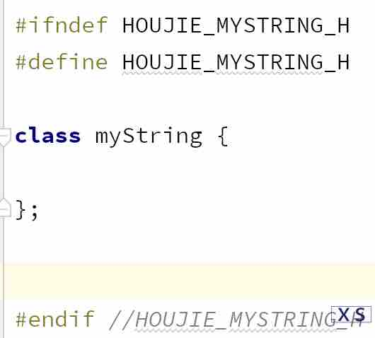
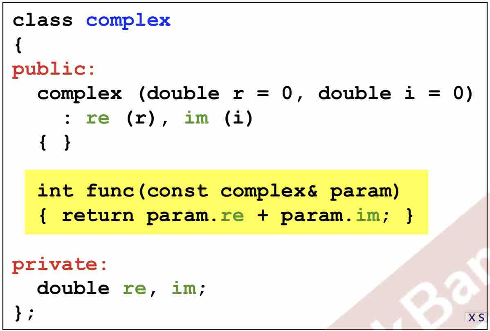
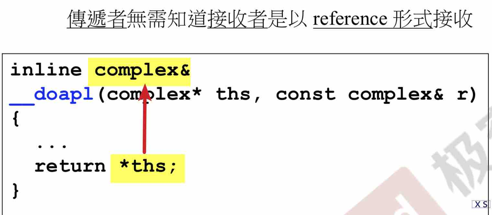
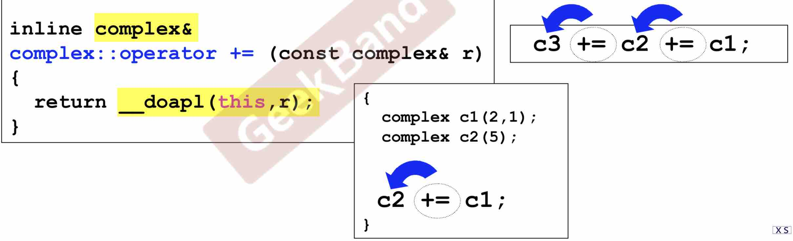
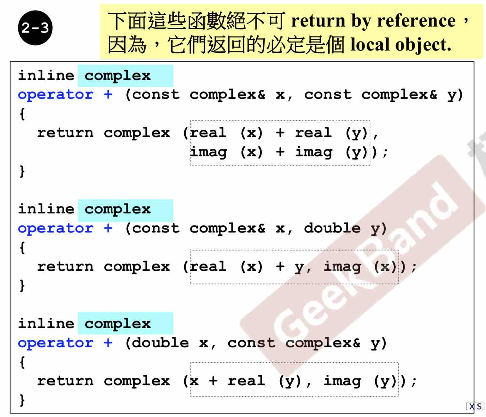
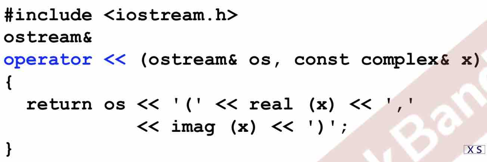

舍友给的C++资料。谢谢琪琪。做个笔记。

<!---more--->

# 1 简介

# 2 头文件与类声明

```cpp
//比如这个是类Complex的头文件：
#ifndef __COMPLEX__
#define __COMPLEX__

    ...

#endif
```

我发现在Clion新建一个类会自动生成的：

其中HOUJIE是我这个项目的名字~

# 3 构造函数

- inline函数，在class body内**定义**完成， **比较快 比较好**。但由于 你要写的函数太复杂，很难将她变成inline。而且就算你把函数写在了class里，是不是inline函数仍由编译器决定。

  - 在class body外的函数**定义**（仅在body内**声明**一下[这时候还不用加`inline`]），可以用`inline`关键字定义，但也只是告诉编译器，你**尽量**把它变成inline

- 构造函数

  ```cpp
  class complex{
      public:
      complex(double r=0, double i=0)
          :re(r), im(i)//初值列。一定要用。赋初值，速度更快。不这样就相当于没赋初值。
  	{ } //构造函数还需要干啥写在这里
  }
  ```

- 关于overloading

  ```cpp
  complex(double r=0, double i=0){}
  complex(){} //可以吗？不可以，因为上一个函数有默认值。两个参数都有默认值，就是可以都不传入，因此冲突
  ```

# 4 const 传值、传引用

- 构造函数放在private里：单例模式（别人不能再用构造函数了，只构造一个实例

- 不改变函数的数据：加`const`!!（函数名后面加）

  `double real() const {return re;}`

> 为啥要尽量加const?
> 类C里的函数f不加const，使用者声明一个const的C实例时，再调用f。编译器会报错。

- 参数传递尽量传Reference

  - Reference to const: 传了引用（速度变快），还不会改变数据内容。-->如果后面要改变传进来的这个const变量，编译器就会报错

- 返回值也尽量传reference（细节，影响效率

- friend 友元 

  - 朋友是打开封装的一个大门，取数据可以用函数（慢），也可以用朋友来直接拿。

  - **同class的各个object互为友元**—》这就可以解释为什么，类的成员函数可以直接取同class的对象的数据：

# 5 操作符重载、 临时对象

- 所有成员函数都有个隐含的this参数，编译器决定了它的位置
-   

- 

  >  返回值其实可以设成void，为啥设成reference呢？

  使用者连串使用的时候， 返回值是reference就起到作用了。 c1加到c2上，		并会让整个式子返回c2的引用。

  怪不得一整条的式子也会有一个值，妙啊。

- 返回的是一个object，**绝对不能返回reference**

  上面返回 reference的例子是，两个数加完存到第一个数里。这次是两个东西加起来，却没有地方存。return了一个临时变量

- << 这个操作符想重载只能写成全局函数。Example：

  

  >  传的参数os可以加&吗？ 

  可以。能传&尽量传&。

  > os为啥不加`const`？ os会改变吗？
  >

  其实， **<< 这个输出符号就是把右侧的东西丢到 os 里**。所以os是不能加&的！

  > 这个函数返回值为啥不写`viod`而写`ostream`

  你想想你天天用 `cout << A << B` 啊！这样就可以连用操作符了啊

  > 返回值写 ostream 还是 ostream&?

  优先考虑&。看一下返回的是新object吗？

  返回os，不是新的。可以返回&

    - 我天天用的cout其实是一个对象（ostream类型）

---

# 6 小节

总结一下一好的类设计：

- 构造函数要会用 Init 的快速赋值方法
- 函数返回加不加const
  - [ ] 我对这一点还是理解不够深入。
  - [ ] 这个函数不改变data 就要加const
- 参数尽可能地加&
- return尽可能地加&
  - return的如果不是local object(不是这个函数创建的东西)，那就加&
- 数据要放在private里

---

告一段落。第6集是总结。可以重刷。

**Problem：**

- [ ] 函数的参数又加const又加&，并在函数里改这个参数的值。会报错？

  > 答：果然报错了。如果要改它的值就别加着加那的了啊孩子。

---

# 7 Big Three 拷贝构造 拷贝赋值 析构

- class with pointer members 必須有 copy ctor 和 copy op=

  - 如果类C有指针。还用默认的拷贝赋值，就叫**浅拷贝**，这时候：

    a和b本来都有thier own指针 point to 一块地，这时候执行 aaa=bbb:

    - bbb指向的那一块成为孤儿--》内存泄露
    - bbb也指向了aaa指向的那块地，a、b会一条命

  - 由上一条得出拷贝赋值的写法：

    `inline ClassA& ClassA::operator=(const ClassA& bbb)`{

    0. **`if (this == &aaa)`**

        ​	**`return *this`**

    1. bbb释放自己的指针

    2. 申请aaa一样大的区域

    3. 赋值

    4. `return *this;`

    }

    第0条特别重要。

最后看一下我自己写的就知道遇到的问题有多多了！

```cpp
#include<iostream>
#ifndef HOUJIE_MYSTRING_H
#define HOUJIE_MYSTRING_H

class myString {
    myString(const char* str = 0);
    myString(const myString& oneString);
    ~myString();

    //myString& const operator=(const myString &oneStr);//在body里声明就不用加myString::了
    myString& operator=(const myString &oneStr);//不能加const 为啥？

//    ostream&operator<<(const myString &oneStr);❌记住"<<"的重载在函数外！

//    char* const getData(){ //const放函数名后
    char* getData() const {
        return m_Data;
    }//这个方法是为了 一会儿重载 << 能取到数据
private:
    char* m_Data;
};

inline myString::myString(const char *str=0) {//这里参数不赋初值！不然会报错：redefinition of default argument
    if(str){
        m_Data = new char[strlen(str)+1];
        strcpy(m_Data,str);
    } else{
        m_Data = new char[1];
        m_Data[0] = '\0';
    }
}

inline myString::~myString() {
    delete m_Data;
}

inline myString::myString(const myString &oneString) {
    m_Data = new char[strlen(oneString.m_Data)+1];
    strcpy(m_Data,oneString.m_Data);
}

inline myString& const myString::operator=(const myString &oneStr) {
//    if(this == oneStr)❌
    if(this == &oneStr)//this是一个指针！
//        return this;❌
        return *this;

//    delete this.m_Data;❌❌❌❌❌ 一定不要忘了[]
    delete[] m_Data;
    this->m_Data = new char[strlen(oneStr.m_Data)+1];//我使用.语法自动变成->语法。为什么？
    strcpy(this->m_Data,oneStr.m_Data);//其实this->全可以省略。只写m_Data就好

//    return this; ❌
    return *this;//是*this! 这也解释了为啥 this后要跟-> this是一个指针
}

//inline ostream& myString::operator<<(const myString &oneStr) {❌ 1不用加类名，人家是根据参数类型来处理的
//2.不加inline  3.有一个ostream参数  4.记得要#include<iostream.h>
ostream& operator<<(ostream& os, const myString &oneStr) {
    return os <<"我是一个string:"<< oneStr.getData();;
}

#endif //HOUJIE_MYSTRING_H

```

简简单单的一个类，里面就有这么多问题！

- 函数声明的时候参数设了默认值。定义的时候就不用写了。

- [ ] << 为啥不能在body里重载来着？

  答：先看对`+`重载，重载后就可以用`myString + myString`语法了。如果把`<<`重载成一个成员函数，就是说可以用`myString << myString`这种操作了。而我们习惯的是cout在左边，要输出的内容在右边。所以不要把 << 重载成成员函数。

- [x] 重载= 为啥不加const?

  >  `myString& operator=(const myString& str)` 这个函数里其实有个隐含参数 this, 而 this 是要改变的。改变了数据就不能加const啦~

道阻且长！

# 8 栈 堆 内存管理

- local object 在作用域中，存在Stack里。自动销毁

  `static loacl object`不会销毁

- `new`的对象存在 heap 里。不会被销毁。需要手动`delete`
- **这一课博大精深。复习请看视频！**

# 9 复习课


# 10 Static

- static

  static函数只能调static属性。

  单例模式可以借助这个实现：

  ```cpp
  A& A:: getInstance(){
      static A a;
      return a;
  }
  ```

# 11复合委托继承

- ♦Composition：复合 ,has-a

- ♢Delegation：委托 

  pImpl(pooint to Implementation)：编译防火墙。右边的代码（代理）怎么改都不影响左边。

  > 延伸：reference counting 共享特性。
  >
  > copy on write: ABC共享一个东西。A想改一下，就给A一个副本让A去改。BC继续共享。

- ▷Inheritance：继承

  与复合一样，构造的时候先构造别人，再构造自己（容器）的。  析构的时候先析构外层的自己，再析构里面的。因为自己是包着继承（复合）类的全部内容。

  继承搭配虚函数才完美

# 12 虚函数

- UML图里斜体表示抽象

- [x] 继承和复合同时用，构造和析构的顺序是怎么样的呢？手写测试


  ```cpp
  B has an A. A构造 B构造 B析构 A析构 
  C is an A. A构造 C构造 C析构 A析构 
  D is an A,having a Z A构造 Z构造 D构造 D析构 Z析构 A析构 
  ```

  可以看出，D继承A，里面复合一个Z的时候。先构造A，再构造Z，最后构造D自己。析构完全相反。