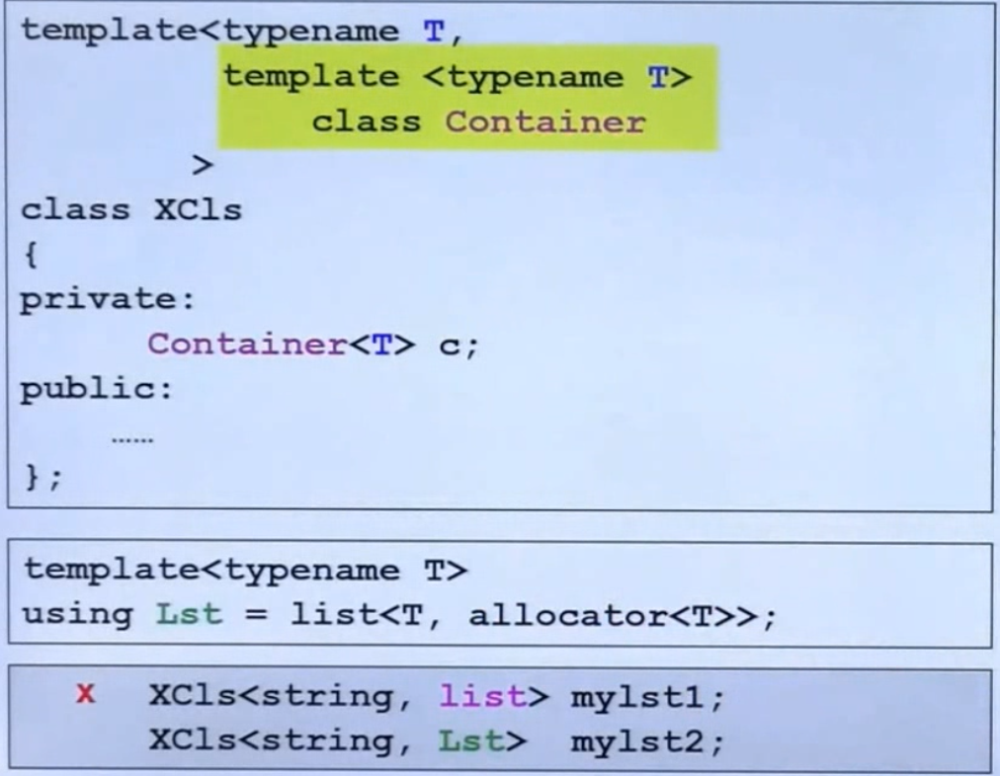

<!---more--->

# conversion function 转换函数

```cpp
class Fraction{
public:
    Fraction(int num,int den=1)
        : m_mumerator(num),m_denominator(den) { }
    operator double() const {
        return (double) (m_numerator/,_denominator);
    }
private:
    int m_numerator;
    int m_denominator;
}
```

`operator double()`注意： 1，不需要写返回类型（本来就是返回double，写了还可能写错） 2，加const（一定不会改数据，也不需要参数）

# non-explicit one argument constructor

```cpp
class Fraction{
public:
    Fraction(int num,int den=1)
        : m_mumerator(num),m_denominator(den) { }
    Fraction operator+(const Fraction & f) {
        return Fraction(...);
    }
private:
    int m_numerator;
    int m_denominator;
}
```

```cpp
Fraction f(3,5);
Fraction d = f+4;
```

4会调构造函数，变成 Fraction类型。两个Fraction可以执行 + 操作。

但是，如果这时候再加上上一节的 conversion 函数，

 f+4 .f可以变成double；4可以变成Fraction 。两条路都能走。编译器就不知道怎么相加了。

这时候怎么让编译器明确选哪条路呢？

## explicit

构造函数写成

```cpp
explicit Fraction(int num,int den=1)
    : m_mumerator(num),m_denominator(den) { }
```

 这个关键字告诉编译器。不要私自用这个构造函数。只有我主动用才能构造。

 标准库里用到的转换函数：


# pointer-like classes

**智能指针**看圆圈里的，`->`这个符号比较特殊。 返回的结果会一直调用下去。所以 重载后的` -> `解引用返回了 px后，自动又出现一个 `->`往下指向`method()`

**迭代器**


这里不太懂。

# function-like classes

重载了 `（）`的类。

# namespace

```cpp
namespace jj01
{
    void func(){ ... }
}
jjo1::func();
```

# Template

 类模板使用的时候要指明类型。

函数模板不需要。 因为编译器可以做“实参推导”，根据你传进的参数，推出要调用什么类型。

>  模板函数都是半编译。最开始的时候编译能过，但是传入参数后，能不能编译不一定了。
>

EX：`<T> bool isbigger(T a,T b){ return a>b}` 模板这么写没问题。但是传进来两个石头。class石头如果重载了 `>` 就能编译过。不然就不行了。

## member Template


在外层的T确定之后，里面的U也可以变化。

第9集。Mark。

# specialization 特化

 

## 偏特化

**个数上的偏**

泛化的T。如果可以为1个位的东西。特化一下，就可以省空间。

**范围上的偏**


就是繁化过的东西再泛化一次。这个东西就有两个泛化的版本。

注意区分这个和第一个完全的特化。

# template template parameter 模板模板参数



