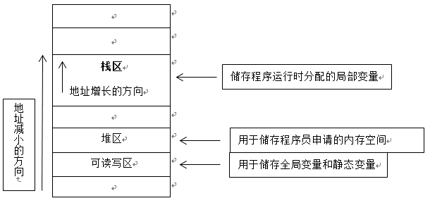

参考文章：https://www.cnblogs.com/ChenZhongzhou/p/5685537.html https://blog.csdn.net/yangyong0717/article/details/78001609

<!---more--->

# 概念

## 数据结构中(与本文无关)

> 栈：是一种**连续**储存的数据结构，具有**先进后出**的性质。通常的操作有入栈（圧栈）、出栈和栈顶元素。想要读取栈中的某个元素，就要将其之前的所有元素出栈才能完成。类比现实中的箱子一样。
>
> 堆：是一种**非连续**的树形储存数据结构，每个节点有一个值，整棵树是**经过排序**的。特点是根结点的值最小（或最大），且根结点的两个子树也是一个堆。常用来实现优先队列，存取随意。

## 内存中

- **栈区(stack)**   

  1 由**编译器**自动分配释放，存放函数的参数值，局部变量的值等。其操作方式类似于数据结构中的栈。

  2 由程序**自动**向操作系统申请分配以及回收，速度快，使用方便，但程序员无法控制。若分配失败，则提示栈溢出错误。注意，const局部变量也储存在栈区内，栈区向地址减小的方向增长。

- **堆区(heap)**   

  1 一般由程序员分配释放，若程序员不释放，程序结束时可能由OS回收。注意它与数据结构中的堆是两回事，分配方式倒是类似于链表。  

  2 程序员向操作系统申请一块内存，当系统收到程序的申请时，会遍历一个记录空闲内存地址的链表，寻找第一个空间大于所申请空间的堆结点，然后将该结点从空闲结点链表中删除，并将该结点的空间分配给程序。分配的速度较慢，地址不连续，容易碎片化。此外，由程序员申请，同时也必须由程序员负责销毁，否则则导致**内存泄露**。

- **全局区（静态区）(static)** 全局变量和静态变量的存储是放在一块的，初始化的全局变量和静态变量在一块区域，未初始化的全局变量和未初始化的静态变量在相邻的另一块区域。   

  程序结束后由系统释放。  

- **文字常量区**   常量字符串就是放在这里的。   程序结束后由系统释放  

- **程序代码区**   存放函数体的二进制代码。  

