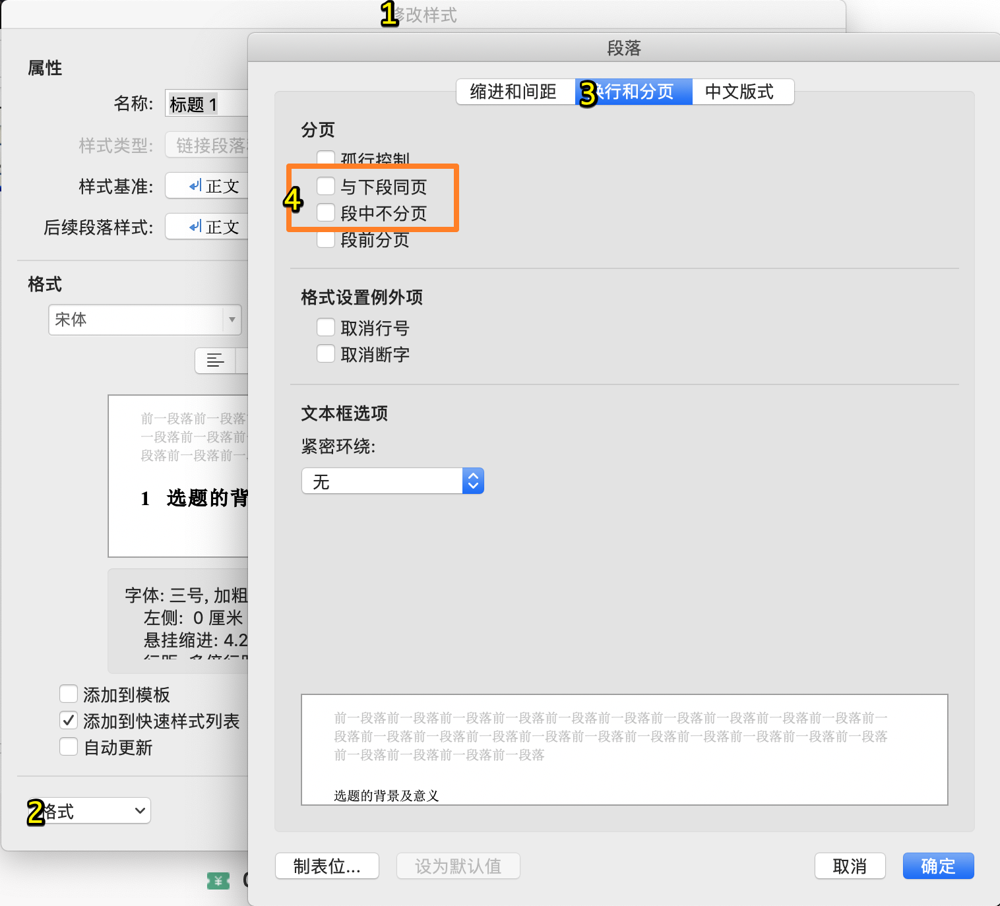

日常使用的一些姿势~

<!---more--->

- 原来PPT可以存成`.ppsx` 的格式，双击打开就直接播放（可与防止被改动


# Markdown折叠效果

<details>
  <summary>就类似这样：Click to expand</summary>
  这里不能插入Markdown了
</details>
其实就是用HTML的`<details>`标签：

```html
<details>
  <summary>Click to expand</summary>
  whatever
</details>
```

# 卸载Adobe Creative Cloud:

官方卸载工具：

https://helpx.adobe.com/cn/creative-cloud/help/uninstall-creative-cloud-desktop-app.html

# Word

## 去掉编号前的·

修改【样式】-【段落】-这两个勾去掉就好了。

# Mac打开SSH服务

mac本身安装了ssh服务，默认情况下不会开机自启

启动sshd服务：

`sudo launchctl load -w /System/Library/LaunchDaemons/ssh.plist`

停止sshd服务：
`sudo launchctl unload -w /System/Library/LaunchDaemons/ssh.plist`

---

查看是否启动：
`sudo launchctl list | grep ssh`

如果看到下面的输出表示成功启动了：

`0 com.openssh.sshd`

---

# Mac改hosts

Finder前往:

/private/etc/hosts

把hosts文件先复制出来。改完替换回去。