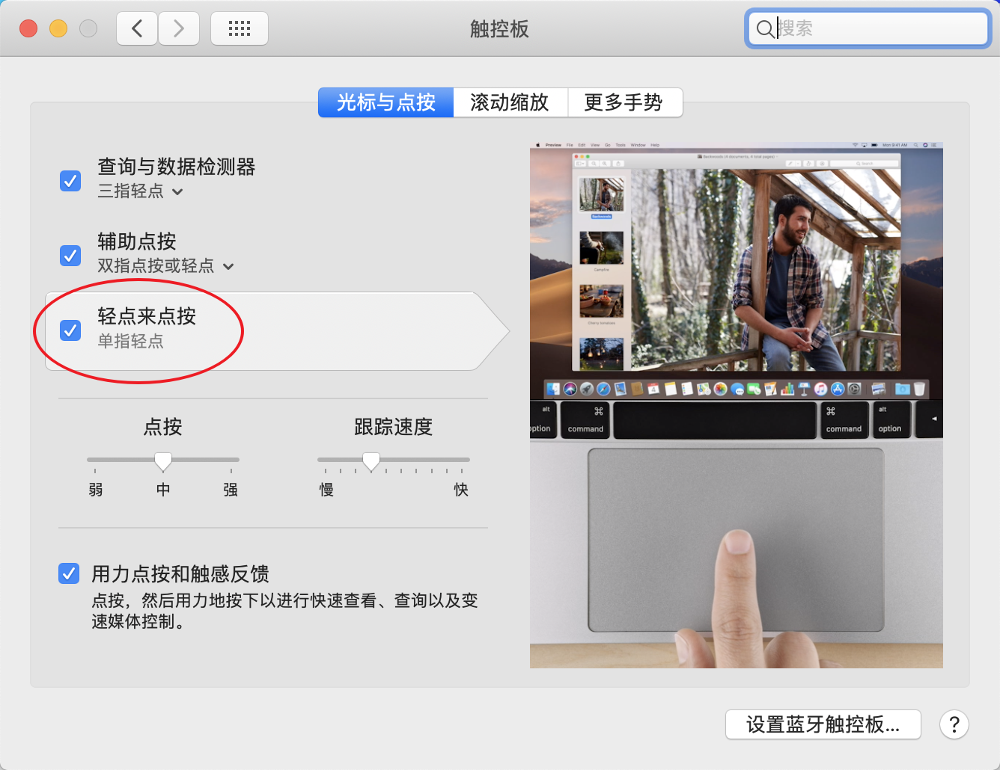
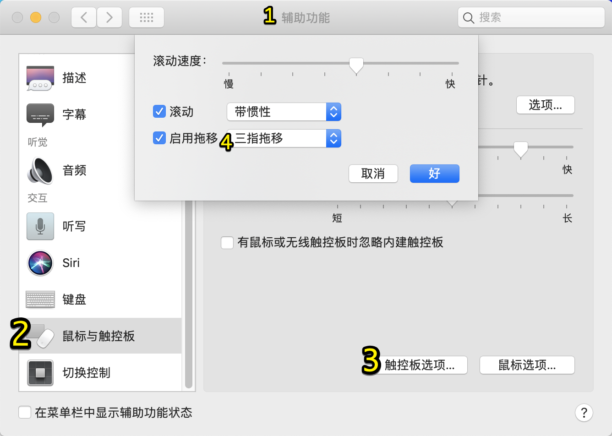
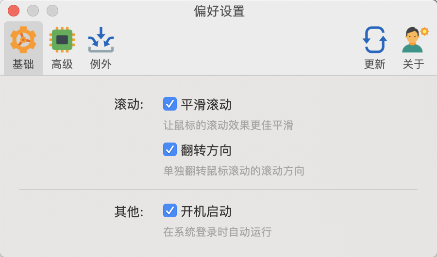
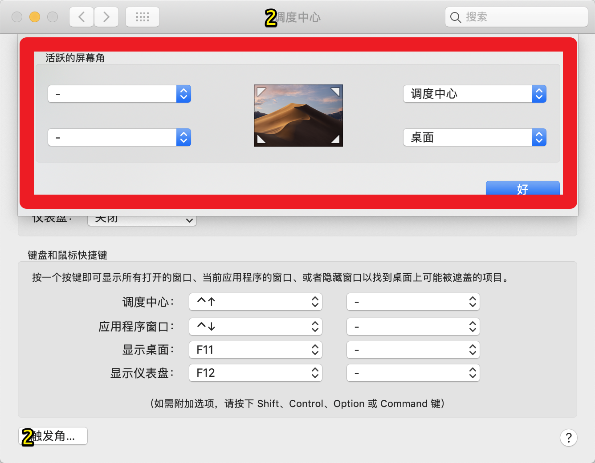

拿到一款崭新的Mac（或是重装了系统），

有一些配置调好可以更方便使用。特此记录，以便以后查阅。

只是我的个人建议。

<!---more--->

# 系统偏好设置 

## 触控板

第一步就是设置轻怕，这个不同多说。

然后，在辅助功能里打开这个，“三指托移”，强烈推荐！

# 鼠标

如果你用鼠标，一定被**触摸板的滚动方向**和**鼠标滚轮的滚动方向**折腾得摸不着北，如果你又是双系统用户就更难受了。

请用Mos：

## 触发角

个人喜欢这么设置：

右上角 调度中心，可以方便切换多个App

右下角桌面就更好用了！

> 可以拖着一个东西，然后把鼠标往右下角一拉，再一松，这个东西就放在桌面上了~反之同理

## 其他

再就是

- 节能里把关屏时间调一下

- 时间调成显示「秒」，日期去掉，改用TinyCal:

  

- 声音显示在菜单栏

  

- VPN显示连接时间：

  

  效果（左1）：

  

- 我的菜单栏展示：

  菜单栏我用了Vanilla这个App给折叠了，截个完整的图看一下，平时在菜单栏不怎么点的都给折叠了：

  

- 触控栏我是留的这四个

  

  注意细节：**【锁屏】放在最右侧**，方便手指定位

  至于触控栏的定制，之前用[BetterTouchTool](https://boastr.net/)改过，但，真的经常弹不出来或者有问题，折腾得心累，放弃了。而且Touchbar除了装逼我想不出第二个优点。Vim用户情何以堪？

# Safari

Safari的偏好设置：

1. 这样更实用

2. 这个勾**不要打**，打上之后有一个问题就是，

   如果你下载的是zip压缩包，**系统会直接解压**缩留下一个文件夹给你。如果你是想用下下来的压缩包文件：不好意思，自己打包吧😂。

3. 最后一点，我觉得Chrome挺好🙃

   特别是从macOS 10.14的Safari装个扩展都费劲。

