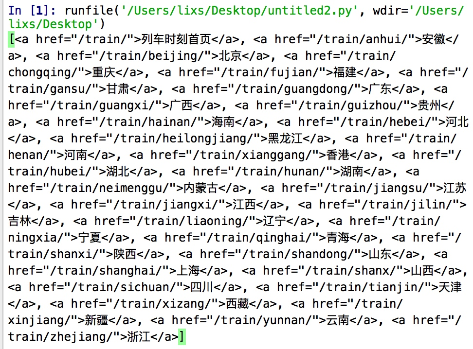

520送点啥呢。有Python不慌~哈哈
我们来试着找一辆5月20号13点14的列车吧~

<!---more--->
# 从分析到实践
## 初探

百度了下列车时刻表，有个ip138，就爬它啦🤭。先读一下第一页的内容：
这网站太老了。竟然不是UTF-8编码的。
解码：
使用urlopen：
`html = urlopen(url).read().decode('GB2312')`

使用Requests：
`r.encode('ISO-8859-1').decode('GB2312')`

OK，可以愉快地玩耍啦。

## 循环读全部列车数据

先从第一页入口读到每个省的数据，根据a标签的href属性很容易发现他们都是/train开头的，正则搞定：
`province = soup.find_all('a',{"href":re.compile("/train/")})`


然后一个循环开始爬这个省的城市，这里的a标签都是以省份的拼音开头的，就是我们上一步的标签i['href']：
`city = soup.find_all('a',{"href":re.compile(i['href'])})`
太多了不上图了。开始读每个城市的列车咯。

由于时刻表被存在了<table>里，所以先用<tr>把每一行跟分开。
然后从tr里用正则找内容是 13:14 的td：
`p=re.compile(r'13:14')`
`if p.search(str(i)):`

这时候发现，并不是所有的13:14都是发车的时间，根据表格内容，第4是发车的时间。我们就把筛出来的数据，split后再判断一下是不是第六列内容是 13:14 ，如果是再append到answer列表：

```Python
if i.text.split()[3] == '13:14':
    answer.append(i.text)`
```

至此所有的代码基本就完成了，可运行起来出了个问题，就是循环队列的网页太多，超时了整个循环都会停止，而且爬了一段时候后一直返回HTTP-Err。
请教下同学，写了个Try的函数：

## 防止HTTP超时

```python
def fun(url):
    result=''
    try:
        result = urlopen(url,timeout=10).read()
    except:
        result = fun(url)
        print('error')
    return result
```
这样，如果超时就会print一个error而且一直递归下去，循环也不会break了。爬网页必备啊~
# 代码

```python
from bs4 import BeautifulSoup
from urllib.request import urlopen
import re
#import webbrowser

base_url = "http://qq.ip138.com"
city = ["train/"]
answer=[]

#his = his.encode('uft-8')

    #url = base_url + his[-1]
html = urlopen("http://qq.ip138.com/train").read().decode('GB2312')
#print(html)
#webbrowser.open(url)
soup = BeautifulSoup(html,features='lxml')

#print(soup.find('a').get_text(),'\n后缀：',city[0])
#找到 属性href是/train/开头 的 a标签
province = soup.find_all('a',{"href":re.compile("/train/")})
def fun(url):
    result=''
    try:
        result = urlopen(url,timeout=10).read()
    except:
        result = fun(url)
        print('error')
    return result
print(province)
for i in province[1:-1]:
    print(i['href'])
    url = base_url+i['href']
    html = fun(url)
    soup = BeautifulSoup(html,features='lxml')
    #读每个省里的城市
    
    city = soup.find_all('a',{"href":re.compile(i['href'])})
    #flag这个省
    
    flag = i['href']
    for i in city[1:-1]:
        #哈哈。终于读到时刻表了
        print(i['href'])
        url = base_url+i['href']
        html = fun(url)
        soup = BeautifulSoup(html,features='lxml')
        train = soup.find_all('tr')
        p=re.compile(r'13:14')
        
        for i in train:
            if p.search(str(i)):
                if i.text.split()[3] == '13:14':
                    answer.append(i.text)

```

## 运行结果


## 收尾工作

原来有好多好多符合条件的列车呀，那么作为花(Qiong)朵（Ren）的我怎么选呢。

哈哈。当然是用到站时间-发车时间计算出最（Pianyi）的那一辆啦。
这里又学到了Python的time包。
给你们个模板拿去用：

```python
import time
#经停时间是第六列
t1 = time.mktime(time.strptime(i.split()[6],'%H:%m')
#到站时间是最后一列
t2 = time.mktime(time.strptime(i.split()[-1],'%H:%m')

t2- t1
```

最后我买了这一班：


哈哈，明天抽个空去取票去~


