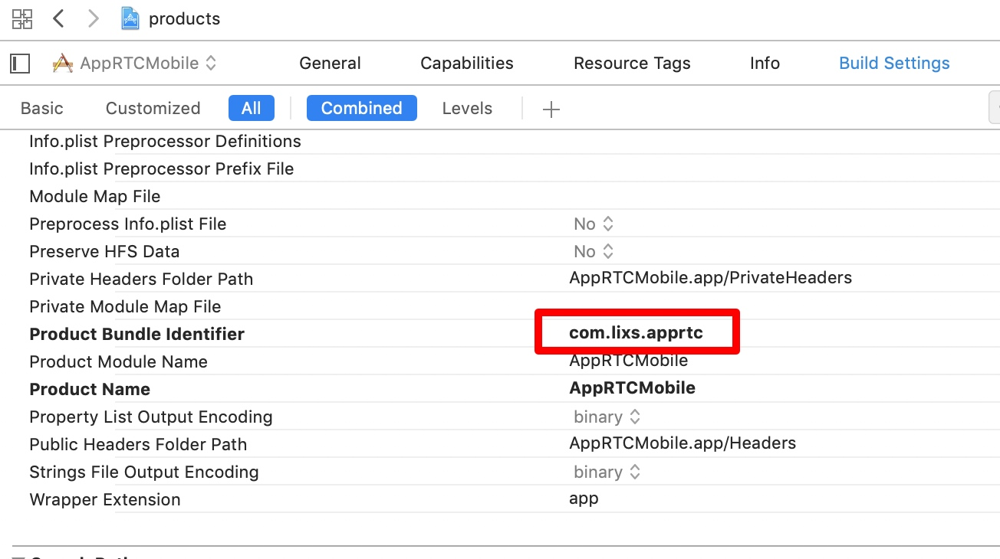

为我的WebRTC第一站做个记录吧。先了解下应用层的东西。

<!---more--->

我发现，我这些学习笔记一点都不技术，跟我的流水账日记差不多～
哈哈。管不了这么多了。我的现阶段，这个水平。写博客就是为了记录我学习的过程。
大体了解WebRTC，里面涉及的东西真的～无法想象的困难。王老师把10g的源码传给我的时候，我一个C++都不会的人，内心多少是拒绝的。
难也要学啊。老师既然把我分到了这个组。就好好跟着王老师学。就算自己学不懂，学习的过程也是极大的提高吧。

---

# iOS Demo 的编译

由于有王老师带，源码直接就传给我了。
但是由于不是自己下的，源码在王老师那里是被编译过的。和签名相关的一些问题导致编译一直报错。

- Bundle id

我根据报错的信息在网上查询，是Bundle Id需要改成我的，对着教程发现很多要修改的地方，我的文件里都没有。整了一上午也没编译成功。
> 王老师：Google开发这个的时候并不是用的Xcode，用了跨平台的东西生成，所以很多地方和默认配置都不同。

结果下午王老师来调了这里直接就好了。



 只要把Product Bundle identifier随便改一个名就行了。
 然后在General里选上我的开发者账号就可以生成新的id了。

 - Depot_tools

新的问题来临。毕竟源码是王老师用的。很多东西都要重新配置。
就比如这一步Depot tools就是不能省的。去解决问题了！

差不多懂Demo的搭建流程了。问题关键不在于Depot_tools

而在于生成 `all.xcworkspace` 这个工程文件的过程。
这样我就可以完全和王老师生成的分离。
主要就下面这两类代码：

/src文件目录下执行:

* **真机项目：**

```sh
gn gen out/ios_64 --args='target_os="ios" target_cpu="arm64"' --ide=xcode
```
* **模拟器项目：**

```sh
gn gen out/ios_sim --args='target_os="ios" target_cpu="x64"' --ide=xcode
```

gn属性 | 描述
--------- | -------------
target_os | 默认值是运行脚本的任何操作系统，运行到ios系统即赋值“ios”
target_cpu| 根据设备的系统架构将其设置为“arm”或“arm64”或"x64"


> 之前在网上搜到的只有 gn gen这一步，并不能生成  `all.xcworkspace` 这个工程文件。再用ninja的命令去建工程。但是我运行就报错。

直到在一个 wiki上看到这种写法。 `--ide=xcode`就可以了~


不错。今天就把Demo搞定了。不过真机运行还不行。王老师说下周给我看看。哈哈~良师益友啊。

