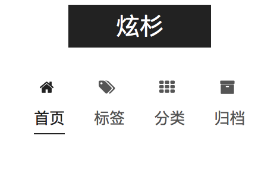

昨天收到一封域名过期的邮件，顺手上去看了看有没有合适的域名。顺手也就搭了个Jekyll的博客。

本托管在coding上，不过云里雾里，弄得还是不满意。

今天决定换成Hexo。再托管在Git上。一节课的功夫，很顺利的就完成了。写个文章记录下。

<!--more-->

今天博客就算是搭建完成了。

# 搭建

## Hexo安装

参考[官方文档](https://hexo.io/docs/)，安装还是顺利的。
## 主题
[Next主题](http://theme-next.iissnan.com)。Hexo半壁江山了快😂😂😂

# Problems

## 分类创建

下载了Next主题。默认是没有开启分类的。查阅文档，找到了创建命令：

```bash
hexo new page "categorie"
```

然后打开自动建立的`index.md` 加入一行：

```
type: "categories"
```

## 设置多Tag

只需要在tag标签里这么写：

```
tag: [tag1,tag2,...]
```

## md文件命名

> 在终端下，Hexo new 出的文章被完全放在` -post`一个文件夹下。
>
> 时间长了这个文件夹岂不是会很乱？
>
> 可是我也不想用Jekyll那种日期的命名方式。
>
> 我是想用子文件夹来当做分类，感觉管理起来也方便很多。

暂时用`date-title`命名的方式吧。


## 插图问题




## 插入媒体

<iframe frameborder="no" border="0" marginwidth="0" marginheight="0" width=330 height=86 
src="//music.163.com/outchain/player?type=2&id=544918737&auto=1&height=66">
</iframe>

```markdown
<iframe frameborder="no" border="0" marginwidth="0" marginheight="0" width=330 height=86 
src="//music.163.com/outchain/player?type=2&id=544918737&auto=1&height=66">
</iframe>
```

看来Hexo是支持`iframe`的

> 支持嵌入HTML

## 自定义域名

手上有个空闲的`.win`域名。就先凑合用着吧。` .io` 等博客成型了就买一个。

试了下把代码部署到 coding.net 上 ,[访问地址](https://ixsim.coding.me)，ping 的平均延迟都能低于50ms 

然而部署都 github.io ，ping 最快也得100 ms【香港节点 2ms，然并卵】

自定义域名方法：

> 1、在source文件夹中新建一个CNAME文件（无后缀名），然后用文本编辑器打开，在首行添加你的网站域名，如xxxx.com，**注意前面没有http://，也没有www**，然后使用`hexo g && hexo d`上传部署。
>
> 2、在域名解析提供商，下面以dnspod为例。
> （1）先添加一个CNAME，主机记录写@，后面记录值写上你的http://xxxx.github.io
> （2）再添加一个CNAME，主机记录写www，后面记录值也是[http://xxxx.github.io](https://link.zhihu.com/?target=http%3A//xxxx.github.io)
> 这样别人用www和不用www都能访问你的网站（其实www的方式，会先解析成[http://xxxx.github.io](https://link.zhihu.com/?target=http%3A//xxxx.github.io)，然后根据CNAME再变成[http://xxx.com](https://link.zhihu.com/?target=http%3A//xxx.com)，即中间是经过一次转换的）。上面，我们用的是CNAME别名记录，也有人使用A记录，后面的记录值是写github page里面的ip地址，但有时候IP地址会更改，导致最后解析不正确，所以还是推荐用CNAME别名记录要好些，不建议用IP。
>
> 3、等十分钟左右，刷新浏览器，用你自己域名访问下试试
>
> 作者：skycrown链接：https://www.zhihu.com/question/31377141/answer/87541858
>
> 来源：知乎著作权归作者所有。商业转载请联系作者获得授权，非商业转载请注明出处。

访问下试试 https://o--o.win

## 同时部署到github和coding

根据Hexo的官方文档，只需要这么设置：

> deploy:
> ​	type: git
> ​	message: [message]
> ​	repo:
> ​		github: <repository url>,[branch]
> ​		gitcafe: <repository url>,[branch] 

Example:


Note: `<repository url>,[branch]`   中 `,`后不要跟空格直接根branch名。

最终还是把域名绑在了Coding。速度快多了。


