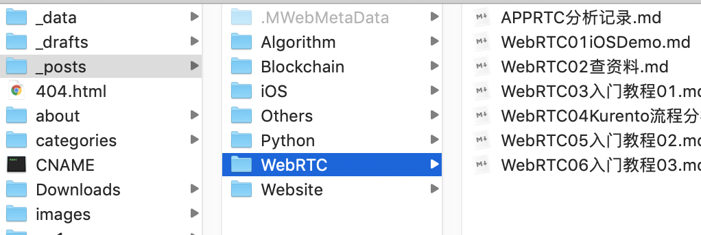
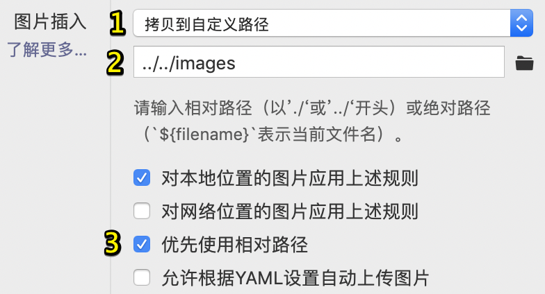
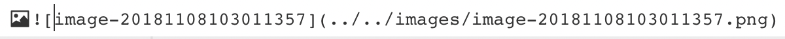

收到七牛云的【测试域名过期通知】时，我不得不写下这篇文章了。

> 怎么让Hexo插入本地图时，本地预览和推送都能正常显示呢？

<!---more--->

# 插件方案

网上搜了下，用这个[hexo-asset-image](https://github.com/CodeFalling/hexo-asset-image)插件的比较多：

然而让我不能接受的就是，用这个插件必须让 `post_asset_folder: true` in  `_config.yml`

这就会导致，每篇博客都带一个同名文件夹。 

**（特别适合每篇文章都会引入各种图片的人）**

这怎么行🙂🙂🙂🙃🙃🙃😤😤😤

我可是在本地也*<u>把文章按照分类分好存在对应文件夹</u>*的☺。

我宁愿费事一点，或者 *<u>牺牲 本地预览效果</u>*  来让文件夹结构清晰。

没想到的是，我这个**<u>*牺牲 本地预览效果*</u>** ，配合上我*<u>**把文章按照分类分好存在对应文件夹**</u>*，竟然就实现了，本地可预览，上传正常显示。

# 最终方案

刚刚说了，我的每个文章都会按照分类存放在一个个的文件夹里，就像这样：

而这时候Typora这么设置

---

**重点来了**

---

- Typora按照上图设置好。

- `hexo new ` 一个新文章，

  此时文章是在 `_post` 根目录下的，

  **我们把它放到对应分类的文件夹里**。比如我放在了`_post/分类1` 里

- 复制图片, 然后直接在Typora粘贴，就会自动生成下面这种格式的路径
   

   > 正是由于我们的文章在`_post/分类1` 这**子目录**下，
   >
   > Typora自动生成的相对路径变成了`../../`    就是往**后退了两级**
   >
   > 而`hexo g`生成的静态页面，对应的images文件夹也是往**后退两级**

- 大功告成。

Typroa本地可预览，生成静态html，图片正常显示