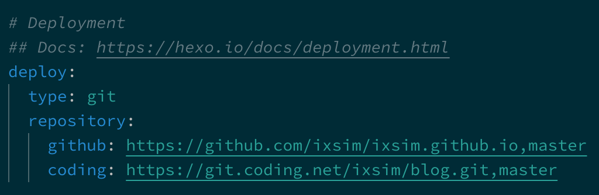

为了方便在两台电脑同时对博客更新，采用了创建分支的方法。将源文件上传。

<!---more--->

# 创建仓库、分支

在博客的Hexo根目录下，正常的建仓库， 并和你要上传的仓库进行关联。

但是我们既然要建分支了，就是要【Push到存放静态网页的仓库】。

关键的语句其实就是`git push origin master:dev-blog`

其中。`origin`是远你给远程仓库起的别名。 `master`代表本地的master分支，`dev-blog`代表远程仓库的dev-blog分支，

> 如果我的仓库以前只用来存放静态网页，并没有这个dev-blog分支，执行了会怎么样？
>
> 答：自动创建dev-blog分支。

Ex,我的这一步就要这样：

```bash
cd Documents/Blog #到博客的根目录下
git init
# 这时候记得更新 .gitignore 文件！
git remote add Coding https://xxxx.git #关联远程仓库，起个别名叫Coding
git add .
git commit -m "推送到Coding测试"
git push Coding master:dev-blog
```

OK，等着就好了。push完后，去你的远程仓库看，会发现，dev-blog分支已经建好了。

以后每次**想Push【源文件】**，执行`git push 仓库名 master:dev-blog`就OK了。

# .gitignore

这么写就可以了：

```
.DS_Store
Thumbs.db
db.json
*.log
node_modules/   #一定要加上这个。这个是npm自动安装的库。不需要推送。
public/
.deploy*/
```

# 更新静态页面

Hexo的推送完全不受影响，和以前一样`hexo g -d`就OK。

它要Push到的【仓库地址，分支名】完全取决于根目录下的`_config.yml`文件 的 deploy 配置。比如我的是这样的：



就是说，执行 `hexo d`的时候，会把【静态页面】push到我设置的那两个仓库的master分支。而我们的源文件是上传到dev-blog分支的。

# 拉取源文件

OK，现在源文件已经到仓库了。怎么在另一台电脑上Pull下来继续写博客呢？

1. 首先确保新电脑上安装好`git`  `node` `hexo`
2. 执行`git clone -b dev-blog xxxx.git`    从原仓库把dev-blog分支克隆下来。

这样源文件就已经在新电脑上了。cd到该目录执行：

```bash
npm install hexo    // 安装hexo  安装完成hexo 不需要初始化hexo，否者hexo 配置参数会重置
npm install    // 安装依赖库
npm  install hexo-deployer-git  --save    // 安装部署相关配置
```

这样Hexo也可以用了。

如果一台电脑要更新源文件，就使用第一步的`git push 仓库别名 master:dev-blog`语句进行Push。Push好了。**记得另一台电脑使用`git pull 仓库别名 dev-blog `来更新源文件！！！**


**参考**：https://www.jianshu.com/p/55f11d8973f0

