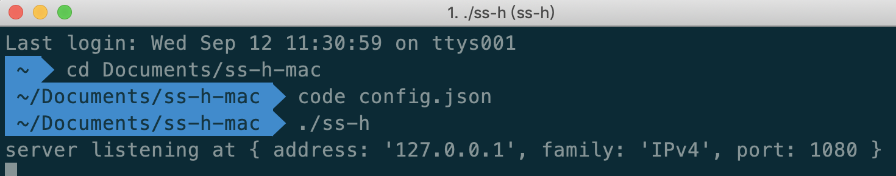
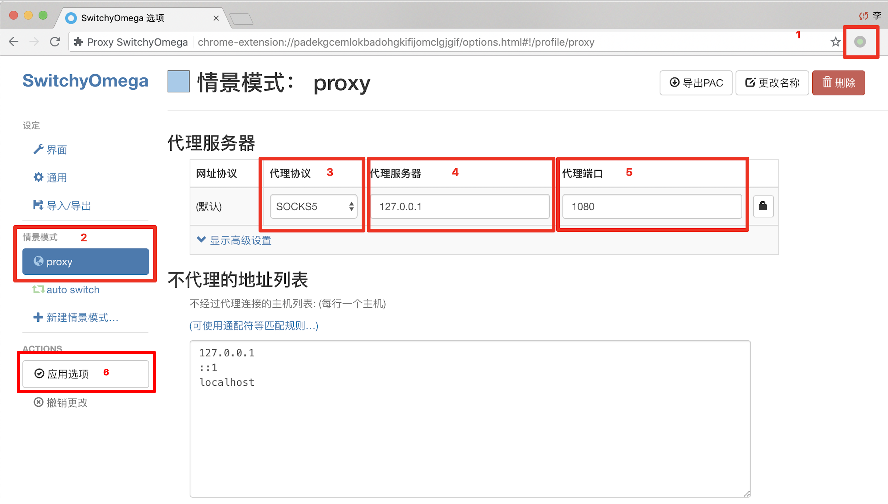
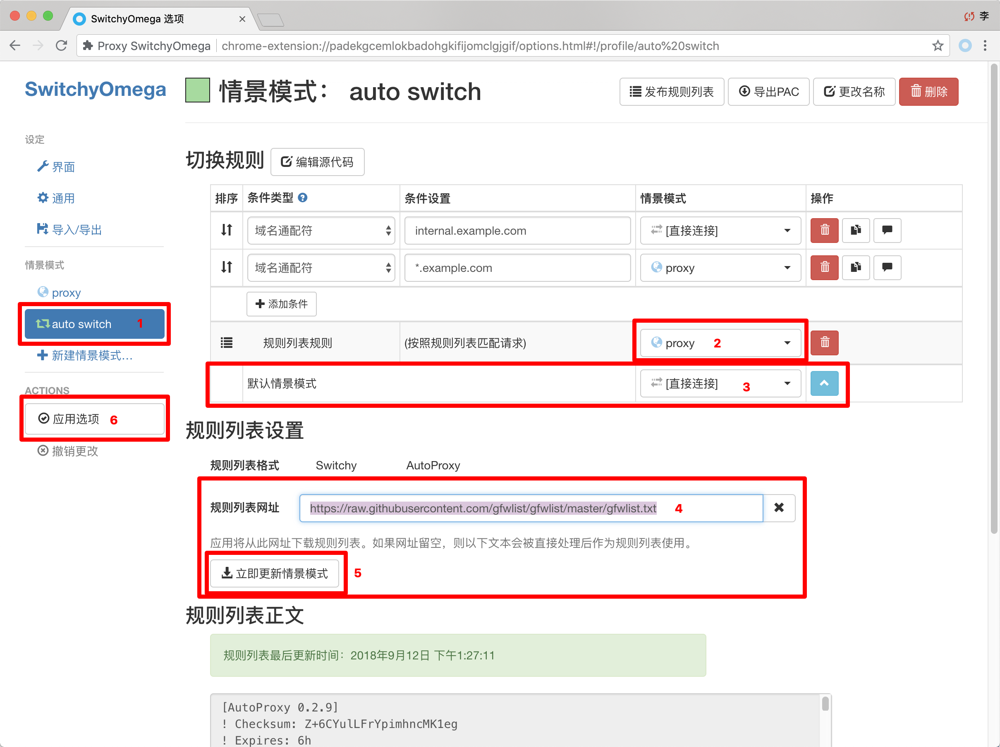

Heroku是日本一家网站。为开发者提供了免费部署项目的服务器。虽然访问**Heroku是被qiang**的。但是用Heroku部署后的应用(saas/web app)其主机在美国和欧洲，且主机地址没有被qiang。利用这一点就可以免费搭建一个自己的ss服务器。

由于有GitHub上的开源项目，其搭建过程可以称之为傻瓜式。

<!---more--->

# 注册Heroku

到这里注册： https://signup.heroku.com/   ~~[*需要富强上网*]~~

> ps：建议用gmail邮箱注册。163啥的应该是注册不了滴

~~这一步需要靠你自己了。什么蓝🙃灯赛🙂风我相信你可以的。~~

~~如果你实在一点办法都没有。我给你俩**在线代理**的网站。速度可能慢点。~~ ~~https://www.anyproxy.top~~ ~~https://www.anyproxy.cn~~~~只能帮你到这了！~~      

**惊奇地发现，Heroku好像不被qiang了😃😃😃**

# 部署

登录上你的Heroku之后，

[-----》》》点这里《《《-----](https://heroku.com/deploy?template=https://github.com/onplus/shadowsocks-heroku/tree/re)

进去之后改两个地方：

- **App name**
  - 起个名字。是唯一标识的。会提示你可不可用。
- **KEY**
  - 设置一个密码。

这两个地方我们会在下一步用到。

一切从简，其他地方不必修改。

# 启动本地客户端

- 下载：https://github.com/onplus/shadowsocks-heroku/releases

  根据你是什么系统。下载对应的客户端压缩包。

- 解压后有个`config.json`文件：

    ```json
    {
      "server": "你设置的AppName.herokuapp.com",
      "local_address": "127.0.0.1",
      "scheme": "ws",
      "local_port": "1080",
      "remote_port": "80",
      "password": "这里输入你设置的密码",
      "timeout": 600,
      "method": "aes-256-cfb"
    }
    ```

- 启动

  - Windows：

    直接打开start或ssh的exe文件都可以打开。区别是一个在后台运行了。一个是有黑框界面。

  - Mac/Linux:

    cd到该目录下，执行`./ss-h` 。你会看到一条server listening at {xxx}的提示。

    

这样本地客户端就启动了。

# 配置代理

在Chrome浏览器安装Proxy SwitchyOmega插件

## 安装Proxy SwitchyOmega

[chrome应用商店下载](https://chrome.google.com/webstore/detail/proxy-switchyomega/padekgcemlokbadohgkifijomclgjgif?utm_source=chrome-ntp-icon)

- 不能访问谷歌的到这里下载：

  http://crx.2333.me/

  进去后输入id：padekgcemlokbadohgkifijomclgjgif

## 配置Proxy SwitchyOmega

如图。6步。



切换到proxy模式就可以Google了~

## 进阶配置

proxy模式就是所有的网站都通过代理来访问。这样其实有点多余。

下面我们通过添加规则，让插件去判断什么情况下启用代理。

在插件的 auto switch里，添加规则列表网站：

`https://raw.githubusercontent.com/gfwlist/gfwlist/master/gfwlist.txt`

如图，记得点应用选项以保存。



这样你选择auto switch模式，插件就可以按照规则来判断是否使用代理。

如果你想访问的 网站不在规则列表里。在上面的规则上自己添加一个条件就好啦~


本篇教程结束。这种方法永久免费还不会被封。

缺点就是只能在PC端使用。关于手机端的教程下次再写啦~